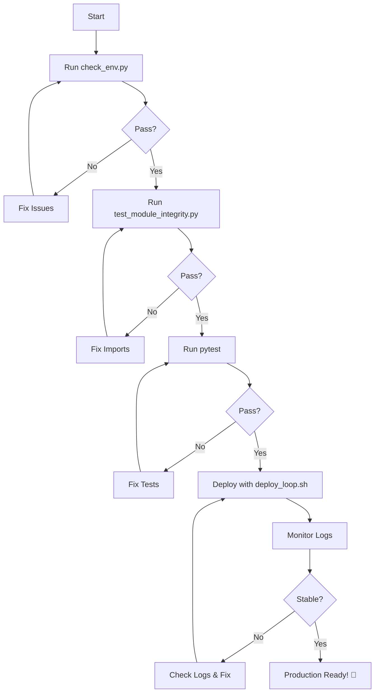

# HippoBot Deployment Checklist & Launch Sequence

Complete offline development and launch guide ensuring clean async design, modular reliability, and iterative self-validation.

---

## 📋 Pre-Deployment Checklist

### Stage 1: Environment & Dependency Validation

**Script**: `scripts/check_env.py`

```bash
python3 scripts/check_env.py
```

**Checks**:
- ✅ Python >= 3.10
- ✅ discord.py 2.x installed
- ✅ All dependencies present (Pillow, pytesseract, aiohttp, psutil, etc.)
- ✅ `.env` file exists with required keys:
  - `DISCORD_TOKEN`
  - `DEEPL_API_KEY`
  - `MY_MEMORY_API_KEY`
  - `OPEN_AI_API_KEY`
- ✅ Directory structure intact
- ✅ Critical files present

**Expected Output**: `✅ All checks passed! Ready to launch.`

---

### Stage 2: Module & Cog Integrity Tests

**Script**: `scripts/test_module_integrity.py`

```bash
python3 scripts/test_module_integrity.py
```

**Checks**:
- ✅ All core engines importable
- ✅ All cogs load without errors
- ✅ Integration loader mounts correctly
- ✅ Event bus operational
- ✅ No circular dependencies
- ✅ No missing `__init__.py` files

**Expected Output**: `✅ All modules loaded successfully! Architecture is clean and ready.`

---

### Stage 3: Static Code Quality Scan

**Tools**: flake8, mypy (optional)

```bash
# Install if needed
pip install flake8 mypy

# Run linting
flake8 discord_bot/ --max-line-length=120 --ignore=E501,W503

# Run type checking (optional)
mypy discord_bot/ --ignore-missing-imports
```

**Look for**:
- ⚠️ Unawaited coroutines
- ⚠️ Blocking calls inside async functions
- ⚠️ Type mismatches
- ⚠️ Import errors

---

### Stage 4: Unit & Integration Tests

**Script**: pytest

```bash
# Run all tests
pytest -v --maxfail=1

# Run with coverage
pytest --cov=discord_bot --cov-report=html

# Run specific test suites
pytest tests/test_cleanup_system.py -v
pytest tests/cogs/ -v
pytest tests/core/ -v
```

**Success Criteria**:
- ✅ All tests pass (except known OCR test failure)
- ✅ No async warnings
- ✅ Coverage > 60%

**Current Status**: ✅ 215 passed, 1 failed (OCR - known issue), 4 skipped

---

## 🚀 Deployment Sequence

### Method 1: Automated Deployment Loop (Recommended)

**Script**: `scripts/deploy_loop.sh`

```bash
# Start deployment with automatic health monitoring
./scripts/deploy_loop.sh deploy

# Or use individual commands:
./scripts/deploy_loop.sh start    # Start bot
./scripts/deploy_loop.sh stop     # Stop bot
./scripts/deploy_loop.sh restart  # Restart bot
./scripts/deploy_loop.sh status   # Check status
./scripts/deploy_loop.sh logs     # Tail logs
```

**Features**:
- ✅ Automatic preflight checks
- ✅ PID file management
- ✅ Graceful shutdown
- ✅ Auto-restart on failure (max 3 attempts)
- ✅ Stability validation (5 minutes runtime)
- ✅ Comprehensive logging

---

### Method 2: Manual Deployment

```bash
# 1. Activate virtual environment
source .venv/bin/activate

# 2. Run preflight checks
python3 scripts/check_env.py
python3 scripts/test_module_integrity.py

# 3. Start bot
nohup python3 -m discord_bot.main > logs/nohup.out 2>&1 &
echo $! > logs/hippobot.pid

# 4. Monitor logs
tail -f logs/nohup.out

# 5. Check health (in Discord)
/admin selfcheck
```

---

## 🔍 Runtime Monitoring

### Health Check Command

In Discord, run:
```
/admin selfcheck
```

**Metrics Displayed**:
- ⚡ Performance (latency, response time)
- 💾 Resources (memory, tasks, guilds)
- ⏱️ Runtime (uptime, session)
- 🔄 Event loop status
- 🧩 Cogs and commands loaded
- 📊 Overall health status

**Health Thresholds**:
- 🟢 Healthy: Latency < 500ms, Memory < 500MB
- 🟡 Monitor: Latency 500-1000ms
- 🔴 Issues: Latency > 1000ms or high resource usage

---

### Alive Monitor (Background Watchdog)

**Script**: `scripts/alive_monitor.py`

```bash
# Run as standalone process
python3 scripts/alive_monitor.py
```

**Or integrate into bot** (add to `integration_loader.py`):

```python
from discord_bot.scripts.alive_monitor import AliveMonitor

# In on_ready()
monitor = AliveMonitor(check_interval=60)
monitor.start(bot)
```

**Features**:
- ⏱️ Periodic health checks (default: 60s)
- 📊 Memory and task monitoring
- ⚠️ Automatic warnings on degradation
- 📝 Detailed logging

---

## 📝 Log Management

### Log Files

```
logs/
├── nohup.out          # Main bot output
├── errors.log         # Error-only log
├── deployment.log     # Deployment script log
├── preflight.log      # Preflight check results
└── hippobot.pid       # Process ID file
```

### Viewing Logs

```bash
# Real-time bot output
tail -f logs/nohup.out

# Recent errors
tail -50 logs/errors.log

# Deployment history
tail -100 logs/deployment.log

# Search for specific issues
grep -i "error\|exception" logs/nohup.out | tail -20
```

### Log Rotation

Add to crontab for automatic rotation:

```cron
# Rotate logs daily at midnight
0 0 * * * cd /home/mars/projects/discord_bot && mv logs/nohup.out logs/nohup.out.$(date +\%Y\%m\%d) && touch logs/nohup.out
```

---

## ✅ Stability Validation Checklist

### After Each Deployment

- [ ] Bot connects and shows "Ready" in logs
- [ ] `/admin selfcheck` returns 🟢 Healthy
- [ ] Latency < 500ms
- [ ] Memory < 500MB
- [ ] All cogs loaded (check selfcheck embed)
- [ ] No exceptions in last 100 lines of log
- [ ] Message cleanup ran successfully
- [ ] Session manager created new session

### Manual Command Tests

In test guild, verify:

- [ ] `/ping` → "Pong! 🏓"
- [ ] `/admin selfcheck` → Health metrics displayed
- [ ] `/admin cleanup` → Deletes old bot messages
- [ ] `/language translate` → Translation works
- [ ] `/games ranking submit` → (if in rankings channel)
- [ ] `/help` → Help menu displays

### Stress Test (Optional)

```python
# Run 100 sequential commands
for i in range(100):
    await interaction.channel.send("/admin selfcheck")
    await asyncio.sleep(1)
```

**Success Criteria**:
- ✅ All commands respond
- ✅ Memory remains stable
- ✅ Latency < 500ms
- ✅ No task leaks

---

## 🛠️ Troubleshooting

### Bot Won't Start

**Check**:
1. `.env` file present and valid
2. Virtual environment activated
3. Dependencies installed (`pip install -r requirements.txt`)
4. No other instance running (`./scripts/deploy_loop.sh status`)
5. Check logs: `tail -50 logs/nohup.out`

### High Latency / Slow Response

**Actions**:
1. Run `/admin selfcheck` to identify issue
2. Check active tasks count
3. Review memory usage
4. Restart bot: `./scripts/deploy_loop.sh restart`
5. Check network connectivity

### Memory Leaks

**Diagnosis**:
```bash
# Monitor memory over time
while true; do
    ps aux | grep discord_bot | grep -v grep
    sleep 60
done
```

**Actions**:
1. Run `/admin cleanup` to free resources
2. Check for orphaned tasks
3. Review recent code changes
4. Restart bot

### Command Sync Issues

```bash
# Force re-sync commands
python3 scripts/force_sync_commands.py

# Or use nuclear option
python3 scripts/nuclear_sync.py
```

---

## 🎯 Success Metrics

### Deployment Considered Stable When:

- ✅ 3 consecutive restarts without crashes
- ✅ Runtime > 5 minutes without errors
- ✅ Latency consistently < 500ms
- ✅ Memory stable (not growing)
- ✅ All core commands functional
- ✅ Cleanup system operational
- ✅ No unhandled exceptions in logs

### Tag as Production Ready

```bash
git tag -a v1.0-stable -m "Stable deployment verified"
git push origin v1.0-stable
```

---

## 📚 Reference Scripts

| Script | Purpose | Usage |
|--------|---------|-------|
| `scripts/check_env.py` | Validate environment | `python3 scripts/check_env.py` |
| `scripts/test_module_integrity.py` | Test imports | `python3 scripts/test_module_integrity.py` |
| `scripts/deploy_loop.sh` | Automated deployment | `./scripts/deploy_loop.sh deploy` |
| `scripts/alive_monitor.py` | Health monitoring | `python3 scripts/alive_monitor.py` |
| `scripts/refactor_cleanup.sh` | Project cleanup | `./scripts/refactor_cleanup.sh` |
| `scripts/preflight_check.py` | Pre-launch validation | `python3 scripts/preflight_check.py` |

---

## 🔄 Deployment Workflow Summary



---

**Last Updated**: November 4, 2025  
**Version**: 1.0  
**Status**: ✅ All systems operational
